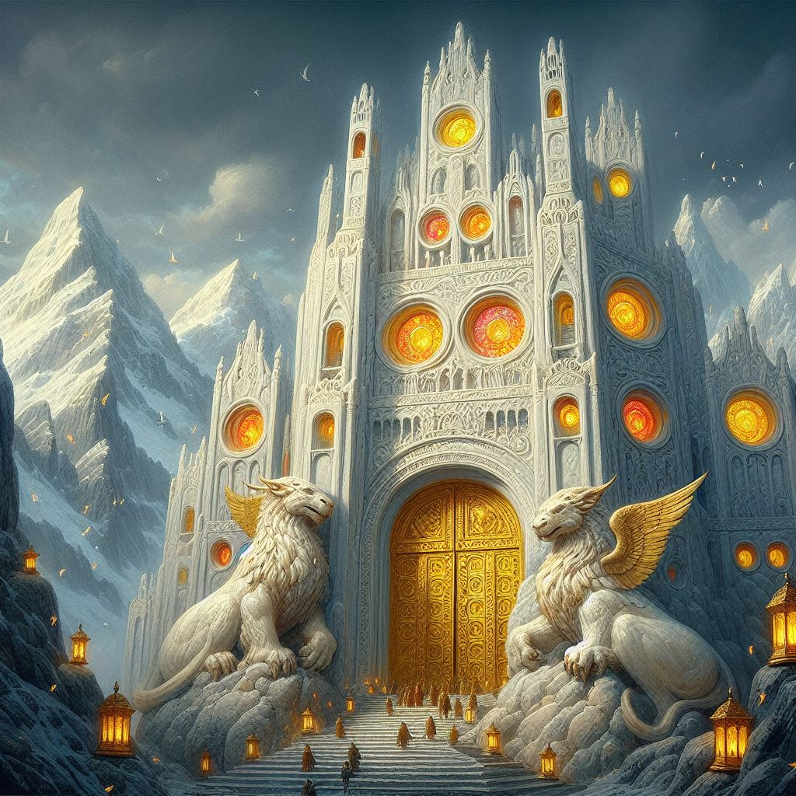
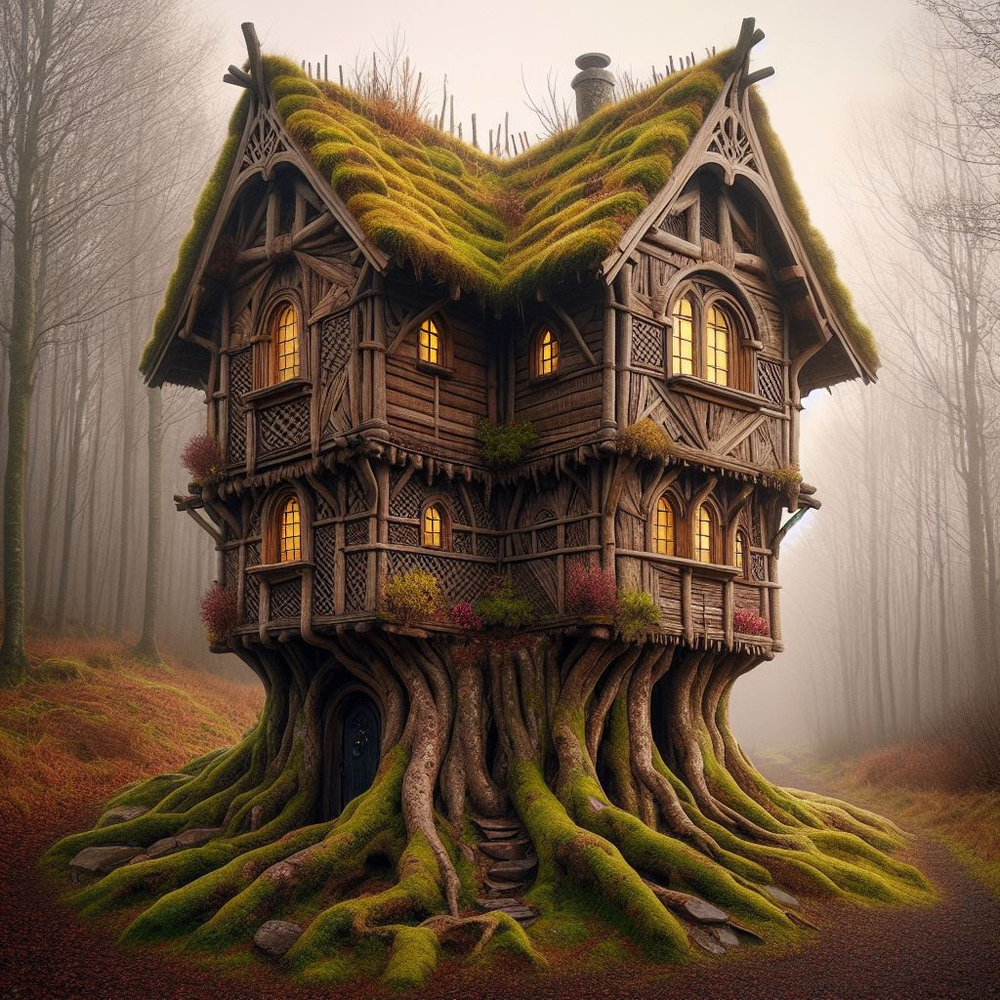

# Visuale *(still under active development)*

## Description

VisualE was crafted to enhance readers' comprehension of descriptive language in books by transforming text into visual representations. It operates with PDF or EPUB files (currently limited to EPUB), scanning each chapter for visually descriptive passages. Utilizing DALLE technology, it generates images corresponding to these descriptions. These images are seamlessly integrated beneath the respective paragraphs, providing readers with a nuanced visual interpretation of the text.

## Example 1
### Text
> They neared the city-mountain, and Eragon saw that the white marble of Tronjheim was highly 
> polished and shaped into flowing contours, as if it had been poured into place. 
> It was dotted with countless round windows framed by elaborate carvings. A 
> colored lantern hung in each window, casting a soft glow on the surrounding 
> rock. No turrets or smokestacks were visible. Directly ahead, two 
> thirty-foot-high gold griffins guarded a massive timber gate—recessed twenty 
> yards into the base of Tronjheim—which was shadowed by thick trusses that 
> supported an arched vault far overhead.

### Image

## Example 2
### Text
> One tree bulged at the base to form a two-story house before sinking its roots into the loam. Both stories
> were hexagonal, although the upper level was half as small as the first, which gave the house a tiered 
> appearance. The roofs and walls were made of webbed sheets of wood
> draped over six thick ridges. Moss and yellow lichen bearded the eaves and hung over jeweled windows set
> into each side. The front door was a mysterious black silhouette recessed under an archway wrought with
> symbols.
> Another house was nestled between three pines, which were joined to it through a series of curved branches.
> Reinforced by those flying buttresses, the house rose five levels, light and airy. Beside it sat a bower
> woven out of willow and dogwood and hung with flameless lanterns disguised as galls.

### Image

## Usage
npm install

1. npm start

2. node server.js *(in another window)*

