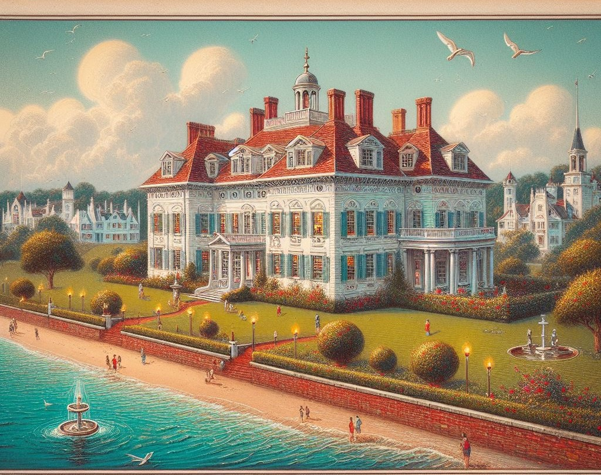
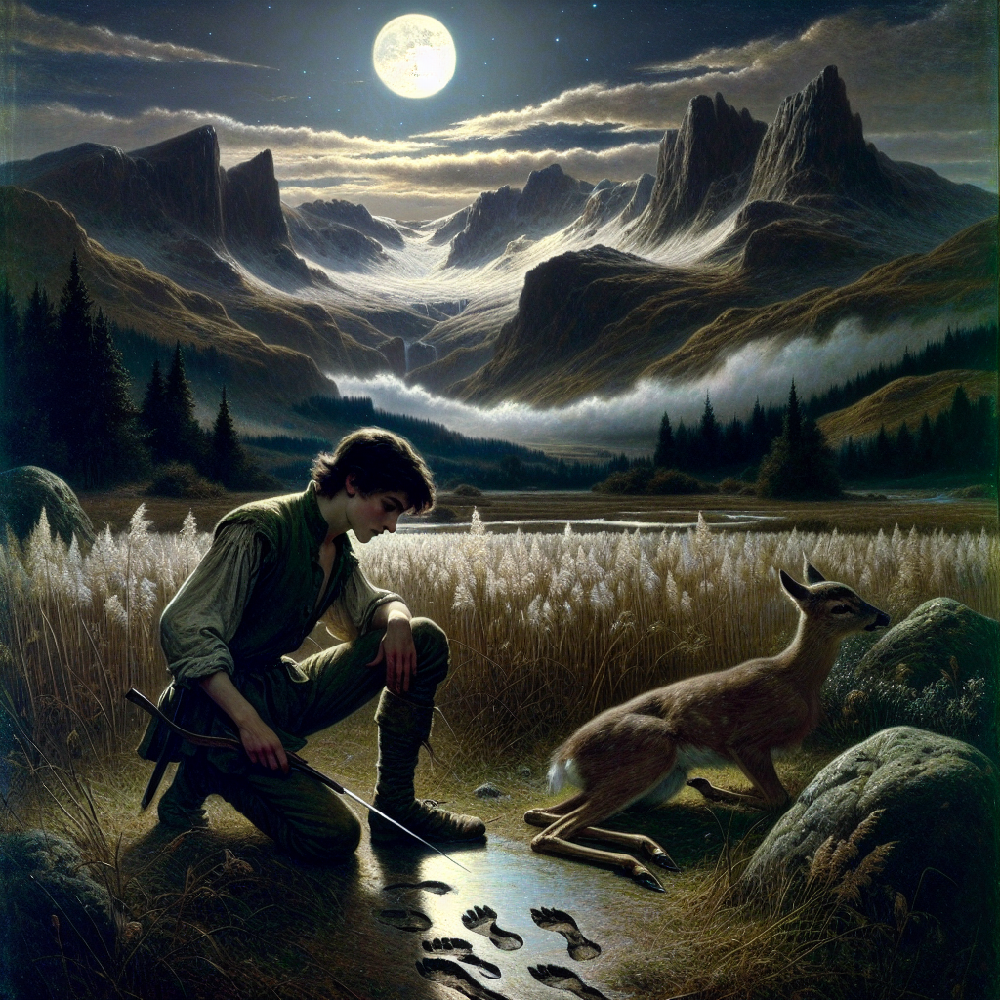

# Visuale *(still under active development)*

## Description

VisualE was crafted to enhance readers' comprehension of descriptive language in books by transforming text into visual representations. It operates with PDF or EPUB files (currently limited to EPUB), scanning each chapter for visually descriptive passages. Utilizing DALLE technology, it generates images corresponding to these descriptions. These images are seamlessly integrated beneath the respective paragraphs, providing readers with a nuanced visual interpretation of the text.

## Example 1
### Text
> Across the courtesy bay the white palaces of fashionable East Egg glittered along
> the water. Their house was even more elaborate than I expected, a cheerful
> red-and-white Georgian Colonial mansion, overlooking the bay. The lawn started at
> the beach and ran toward the front door for a quarter of a mile, jumping over
> sun-dials and brick walks and burning gardens—finally when it reached the house
> drifting up the side in bright vines as though from the momentum of its run. The
> front was broken by a line of French windows, glowing now with reflected gold and
> wide open to the warm windy afternoon

### Image

## Example 2
### Text
> They neared the city-mountain, and Eragon saw that the white marble of Tronjheim was highly 
> polished and shaped into flowing contours, as if it had been poured into place. 
> It was dotted with countless round windows framed by elaborate carvings. A 
> colored lantern hung in each window, casting a soft glow on the surrounding 
> rock. No turrets or smokestacks were visible. Directly ahead, two 
> thirty-foot-high gold griffins guarded a massive timber gate—recessed twenty 
> yards into the base of Tronjheim—which was shadowed by thick trusses that 
> supported an arched vault far overhead.

### Image

## Example 3
### Text
> Eragon knelt in a bed of trampled reed grass and scanned the tracks with a practiced eye. 
> The prints told him that the deer had been in the meadow only a half-hour before. 
>Soon they would bed down. His target, a small doe with a pronounced limp in her 
> left forefoot, was still with the herd. He was amazed she had made it so far 
> without a wolf or bear catching her. 
 
> The sky was clear and dark, and a slight breeze stirred the air. A silvery cloud drifted 
> over the mountains that surrounded him, its edges glowing with ruddy light cast 
> from the harvest moon cradled between two peaks. Streams flowed down the 
> mountains from stolid glaciers and glistening snowpacks. A brooding mist crept 
> along the valley’s floor, almost thick enough to obscure his feet.”

### Image

## Usage
npm install

1. npm start

2. node server.js *(in another window)*

